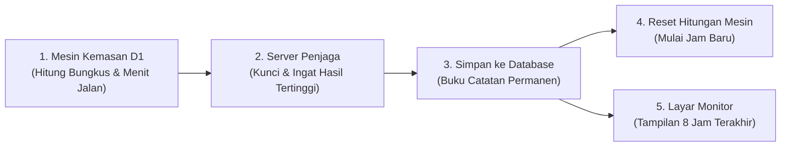
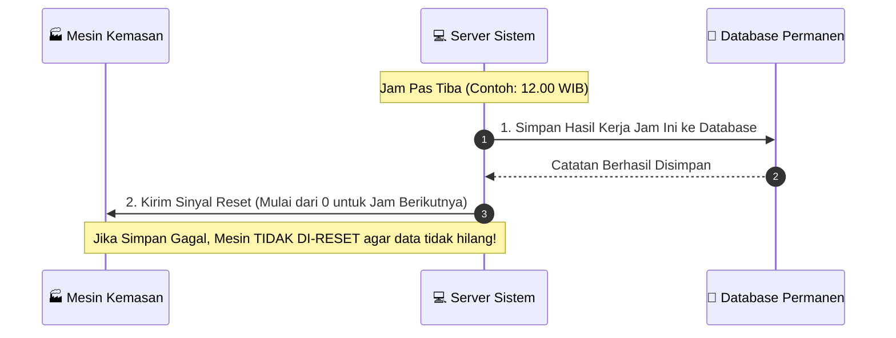

# 📘 Panduan Sederhana: Bagaimana Data Mesin Dicatat & Disimpan

Dokumen ini menjelaskan dengan bahasa yang mudah dipahami tentang bagaimana data produksi dari **Mesin Kemasan (D1)** otomatis dicatat, dijaga dari kehilangan, dan ditampilkan di layar monitor.

---

## 💡 Analogi Sederhana

Bayangkan sistem ini bekerja seperti **Kasir Toko yang Disiplin**:
1. **Mesin Kemasan** = Mesin kasir yang menghitung barang ter-jual per jam.
2. **Server Aplikasi** = Asisten yang selalu mencatat dan mengingat angka tertinggi.
3. **Database** = Buku Besar / Brankas yang menyimpan catatan permanen.
4. **Layar Dashboard** = Papan Pengumuman untuk melihat hasil produksi secara langsung.

---

## 🔄 4 Langkah Mudah Perjalanan Data

---

### **Langkah 1: Mesin Menghitung Hasil Kerja**
* Setiap detik, mesin terus menghitung dua hal utama:
  1. **Lama Mesin Berjalan (Uptime)** — berapa menit mesin aktif bekerja.
  2. **Jumlah Produk (Output Pouch)** — berapa kantong/bungkus yang berhasil dikemas.

---

### **Langkah 2: Proteksi Pelindung (Mencegah Data Hilang)**
* Bagaimana jika mesin tidak sengaja di-reset atau mati 5 menit sebelum jam berganti?
* **Solusi Otomatis**: Sistem secara cerdas selalu **mengingat angka tertinggi** yang dicapai pada jam tersebut. Jadi walaupun angka di mesin mendadak kembali ke `0`, angka tertinggi tidak akan hilang.

---

### **Langkah 3: Aturan "Simpan Dulu, Baru Reset"**
Tepat pada saat jam berganti (misalnya jam `10.00`, `11.00`, `12.00` pas):

---

### **Langkah 4: Tampilan Ringkas di Layar Monitor**
Di layar monitor (Web Dashboard), siapa pun bisa langsung melihat:
* **Grafik & Log 8 Jam Terakhir** — melihat performa 8 jam ke belakang.
* **Kecepatan Mesin Aktual** — berapa bungkus yang berhasil dibuat per menitnya.
* **Status Kemacetan (Downtime)** — mendeteksi jika ada waktu mesin berhenti bekerja.

---

## 🌟 Keuntungan Bagi Operasional Pabrik

| Masalah Dulu | Solusi Sistem Sekarang |
| :--- | :--- |
| ❌ Operator harus catat manual tiap jam | ✅ **Otomatis 100%** tanpa perlu dicatat manual |
| ❌ Takut data hilang kalau mesin di-reset duluan | ✅ **Aman**: Angka tertinggi selalu tersimpan rapi |
| ❌ Suka ada data ganda di jam yang sama | ✅ **Rapi**: 1 Jam pas hanya punya 1 catatan di database |
| ❌ Hitungan kecepatan tidak akurat | ✅ **Presisi**: Kecepatan dihitung murni dari hasil jam berjalan |
